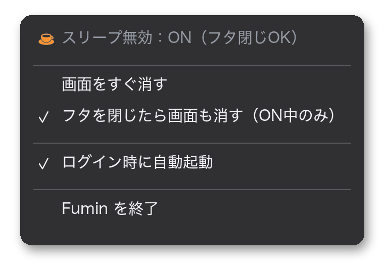

# Fumin 🌙→🟠


**不眠 — 眠らないMac。**

MacBookのフタを閉じても、中の作業を止めずに動かし続けるための小さな無料アプリ。メニューバー（画面右上の時計のあたり）に常駐していて、クリックひとつでON/OFFを切り替えられる。

## なにをするアプリ？

MacBookはフタを閉じると自動でスリープに入る。ふだんは便利な仕組みだが、困る場面がある。Claude CodeやCodexに長い作業を任せている途中。大きなファイルのダウンロード中。動画の書き出しやバックアップの最中。フタを閉じた瞬間、全部止まる。

Fuminは、この「フタを閉じたら寝る」をOFFにできるスイッチ。机の上でフタを閉じたまま、Macに仕事を続けさせられる。ただしカバンに入れるのは厳禁（[使うときの注意](#使うときの注意)を参照）。

## アイコンの意味

- 🌙 `moon.zzz`（通常色）= **通常モード**（フタを閉じると普通にスリープ）
- 🟠 オレンジのカップ = **スリープ無効モード ON**（フタを閉じても起き続ける）

「コーヒーを飲んで起きてる」と覚えると忘れない。


## インストール

手順は3つ。

1. [Releasesページ](https://github.com/Yanagi-1112/fumin/releases/latest)から `Fumin.zip` をダウンロード
2. zipをダブルクリックで解凍し、出てきた `Fumin.app` を「アプリケーション」フォルダへドラッグ
3. `Fumin.app` をダブルクリックで起動

初回起動時に「開発元を確認できないため開けません」と出ることがある。その場合はシステム設定 → プライバシーとセキュリティを開くと、下の方に「"Fumin"は…」という項目が出ているので、「このまま開く」を押せば起動できる。Appleの開発者登録（年間99ドル）をしていない個人アプリに必ず出る警告で、中身はこのリポジトリで公開しているコードそのもの。

<details>
<summary>自分でビルドしたい人向け（ターミナルが使える人）</summary>

```sh
git clone https://github.com/Yanagi-1112/fumin.git
cd fumin
./build.sh          # /Applications/Fumin.app を生成
open /Applications/Fumin.app
```
Xcode Command Line Toolsが必要（`xcode-select --install`）。
</details>

## 初回セットアップ（1回だけ）

スリープ設定はmacOSの深い場所にあるため、変更にはFuminへの許可がいる。初めてアイコンをクリックすると案内が出るので、「コマンドをコピー」を押して、ターミナル（Launchpadで「ターミナル」と検索）に貼り付けてEnter。Macのログインパスワードを聞かれる。入力しても画面には何も表示されないが、ちゃんと入っている。

```sh
echo "$(whoami) ALL=(root) NOPASSWD: /usr/bin/pmset" | sudo tee /etc/sudoers.d/fumin >/dev/null && sudo chmod 440 /etc/sudoers.d/fumin
```

書き込まれるのは「pmsetというAppleの省電力設定コマンドに限り、パスワードなしで実行してよい」という許可の1行だけ。それ以外の権限は与えない。

## 使い方

左クリックでON/OFFをトグル（🌙⇄🟠）。右クリック（またはControl+クリック）でメニューが開く。



| 項目 | 説明 |
|---|---|
| 画面をすぐ消す | 画面だけオフにする（中の作業は動き続ける） |
| フタを閉じたら画面も消す | 外部モニタ運用（クラムシェル）で、フタを閉じたらモニタも自動で暗くする |
| ログイン時に自動起動 | Macを起動したらFuminも自動で立ち上げる |

離席するときの流れはこう。Fuminをクリックして🟠にして、フタを閉じる。Macは起きたまま、作業が続く。戻ってきたらフタを開けて、クリックで🌙に戻す。

## 安全性

正体のよくわからないアプリにMacの設定を触らせるのは気持ちが悪いと思う。だから中身は全部見られるようにしてある。

- ソースコードは [`Fumin.swift`](Fumin.swift) の1ファイル、約200行。全文をこのリポジトリで公開している
- ネットワーク通信のコードは存在しない。何も送信しないし、何も集めない
- 実行するのはAppleの正規コマンド `pmset` だけ。ファイルやデータには触れない
- OFFにしたとき・終了したとき・起動したときの3か所で、必ず「普通にスリープする状態」へ戻す。スリープしないまま放置される事故を防ぐための保険
- 無料。広告なし。MITライセンス

## 困ったときの魔法の呪文

何かおかしいと感じたら、ターミナルでこれを実行すれば即・通常状態に戻る:

```sh
sudo pmset -a disablesleep 0
```

## 使うときの注意

フタを閉じていてもMacは動いていて、熱を出す。カバン・引き出し・布団の上は厳禁。硬くて風通しのよい机かスタンドの上で、電源アダプタにつないで使うこと。

## アンインストール

```sh
osascript -e 'quit app "Fumin"' 2>/dev/null
rm -rf /Applications/Fumin.app
sudo rm -f /etc/sudoers.d/fumin
```

## 仕組み（技術メモ）

- ON: `sudo -n pmset -a disablesleep 1`（フタ閉じスリープを無効化）＋ `caffeinate -imsu`（アイドルスリープ抑止）
- OFF / 終了 / 起動時: 必ず `pmset -a disablesleep 0` に戻す
- 画面消し: `pmset displaysleepnow`（root不要）。フタの開閉は `IOPMrootDomain` の `AppleClamshellState` で検出。キーボード・マウスに触れると画面は復帰する

## 動作環境

macOS 13 (Ventura) 以降。Apple Silicon・Intel両対応。

## ライセンス

[MIT](LICENSE)
